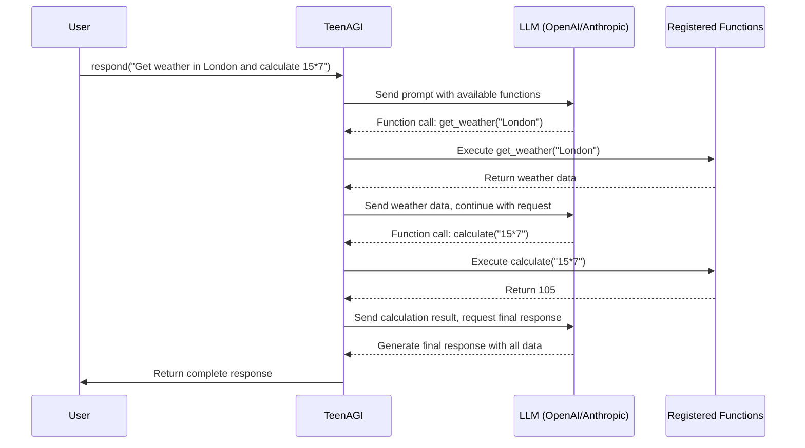

# TeenAGI

A Python package for building AI agents capable of making multiple function calls in sequence. Inspired by BabyAGI but with more advanced capabilities.

## Table of Contents
- [Installation](#installation)
- [Usage](#usage)
  - [Setting Up API Keys](#setting-up-api-keys)
  - [Python API](#python-api)
  - [Command Line Interface](#command-line-interface)
  - [Function Registration](#function-registration)
- [How It Works](#how-it-works)
- [Development](#development)
  - [Setup Development Environment](#setup-development-environment)
- [License](#license)
- [Contributing](#contributing)

## Installation

```bash
pip install teenagi
```

## Usage

### Setting Up API Keys

TeenAGI requires API keys to be stored in a `.env` file in your project directory. Create a file named `.env` with the following content:

```
# For OpenAI GPT models
OPENAI_API_KEY=your_openai_api_key_here

# For Anthropic Claude models
ANTHROPIC_API_KEY=your_anthropic_api_key_here
```

This file should be kept secure and never committed to version control.

### Python API

```python
from teenagi import TeenAGI, create_agent

# TeenAGI will automatically load API keys from your .env file
agent = TeenAGI(
    name="Research Assistant",
    provider="openai",  # "openai" or "anthropic"
    model="gpt-4.1
)

# Add capabilities to the agent
agent.learn("can search the web for information")
agent.learn("can summarize long documents")

# Get a response that might require multiple function calls
response = agent.respond("Find and summarize recent research on climate change")
print(response)

# Alternative: use the factory function with Anthropic
specialized_agent = create_agent(
    name="DataAnalyst",
    provider="anthropic",
    model="claude-3-opus-20240229"
)
```

### Command Line Interface

TeenAGI includes a CLI for quick interactions. It will automatically use the API keys from your `.env` file:

```bash
# Basic usage
teenagi --name "ResearchBot" --capabilities "can search the web" "can summarize text" "Find recent papers on quantum computing"

# Using with OpenAI (requires OPENAI_API_KEY in .env)
teenagi --provider openai --model "gpt-4" "Explain quantum entanglement"

# Using with Anthropic (requires ANTHROPIC_API_KEY in .env)
teenagi --provider anthropic --model "claude-3-sonnet-20240229" "Explain quantum entanglement"
```

### Function Registration

TeenAGI can call actual Python functions. Here's how to register and use functions:

```python
from teenagi import TeenAGI
import datetime

# Create an agent
agent = TeenAGI(name="AssistantBot", provider="anthropic")

# Register functions using the decorator syntax
@agent.register_function(description="Get the current date and time")
def get_current_time() -> str:
    """Get the current date and time."""
    now = datetime.datetime.now()
    return now.strftime("%Y-%m-%d %H:%M:%S")

@agent.register_function(description="Get weather information for a location")
def get_weather(location: str) -> dict:
    """
    Get current weather for a location.
    
    Args:
        location: City name or location
    """
    # In a real app, you'd call a weather API
    return {
        "location": location,
        "temperature": 72,
        "condition": "Sunny",
        "humidity": 65
    }

# Add capabilities to the agent
agent.learn("can check the current time")
agent.learn("can get weather information")

# Let the agent use the functions
response = agent.respond("What time is it now and what's the weather in New York?")
print(response)
```

The agent will:
1. Determine which functions to call based on the user's request
2. Call the appropriate functions with the right parameters
3. Incorporate the function results into the final response

When calling functions, TeenAGI will:
- Automatically parse and validate function arguments
- Handle type conversions
- Provide helpful error messages
- Support complex parameter types
- Allow multiple function calls in sequence

## How It Works

TeenAGI enables LLMs to use registered Python functions based on the user's request. Here's how it works:



The process follows these steps:

1. **Registration**: Register Python functions with the agent
2. **Request**: User sends a natural language request
3. **Function Selection**: LLM determines which functions to call based on the request
4. **Execution**: TeenAGI executes the selected functions with the provided arguments
5. **Iteration**: Results are fed back to the LLM, which may call additional functions
6. **Response**: After all necessary functions are called, a final response is generated

This approach allows TeenAGI to perform real actions and access external data sources while maintaining a simple, natural language interface.

## Development

### Setup Development Environment

```bash
# Clone the repository
git clone https://github.com/plowsai/teenagi
cd teen-agi

# Install dependencies with Poetry
poetry install

# Create a .env file with your API keys
echo "OPENAI_API_KEY=your_key_here" > .env
# or
echo "ANTHROPIC_API_KEY=your_key_here" > .env

# Run tests
poetry run pytest
```

## License

MIT

## Contributing

Contributions are welcome! Please feel free to submit a Pull Request.
